# T03: Serveis de transferència de fitxers

- El primer que hem de fer es configurar els adaptadors, un en **NAT** i un en **host-only**.

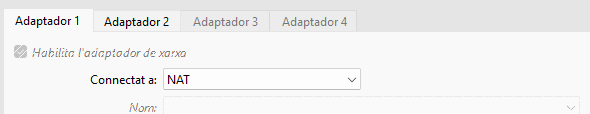
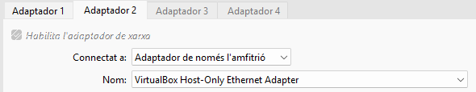

- Ara instal·lem **FTP** un cop intal·lat fem una copia de l'arxiu de configuració del servei

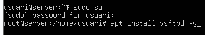

- Ens connectem al servei FTP

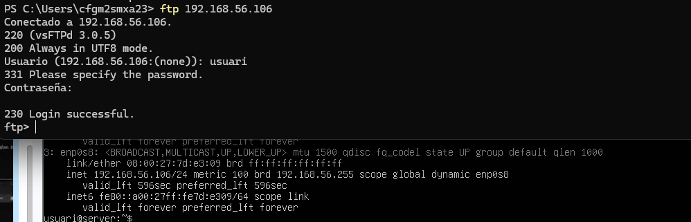

- Creem el usuari FTP i modifiquem els permisos ftp

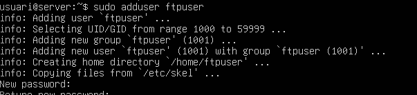
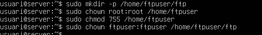

- Modifiquem el arxiu ftp

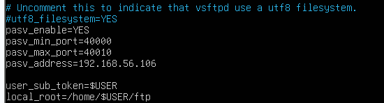

- Configurem els ports

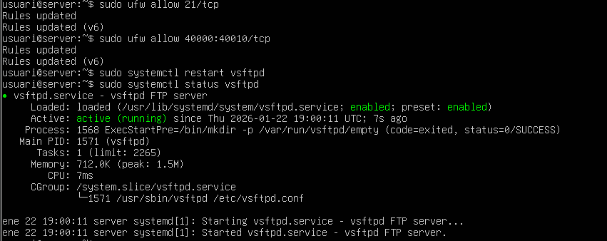

- Ara ens connectem al servei FTP

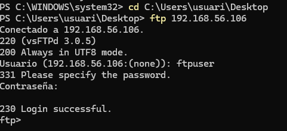

- Amb filezilla 

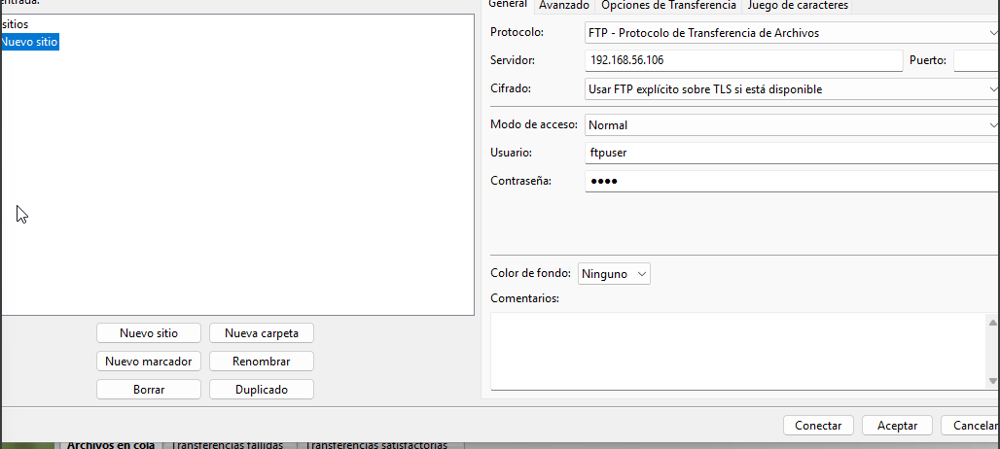

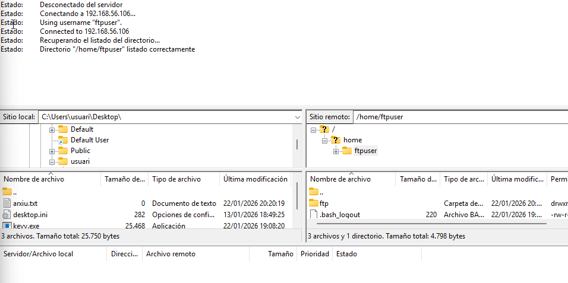

## SFTP

- Configuren ssh

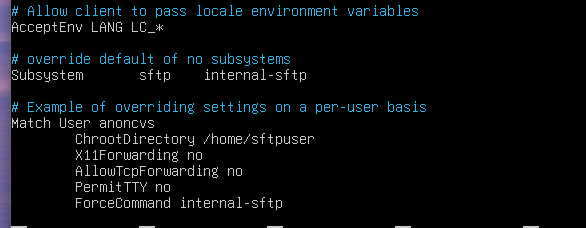

- Creem l'usuari de sftp i els directoris

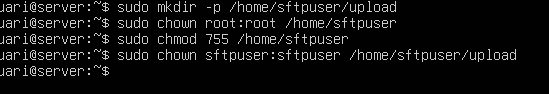

- Ens connectem al servidor 

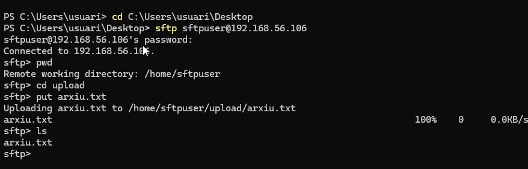

- Amb filezilla en connectem al servidor

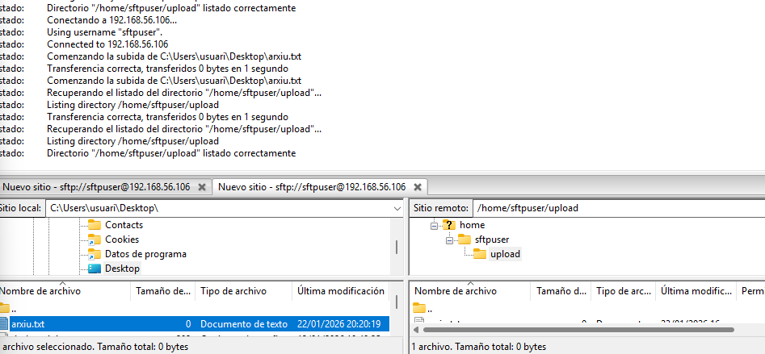