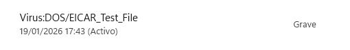
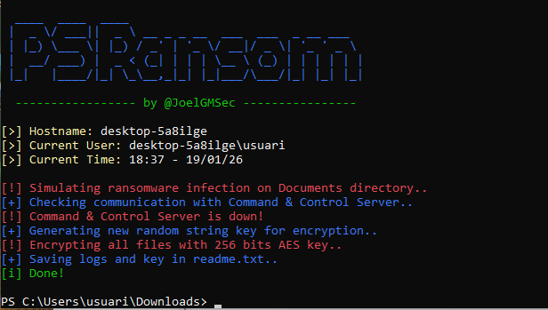
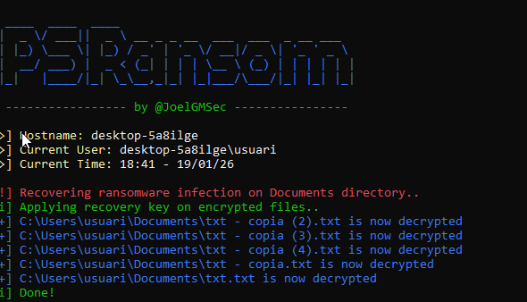
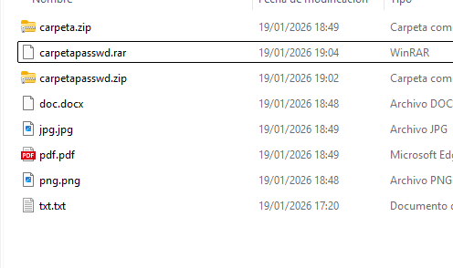
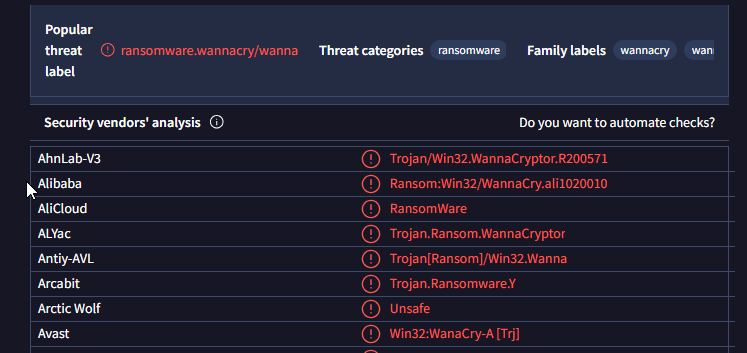
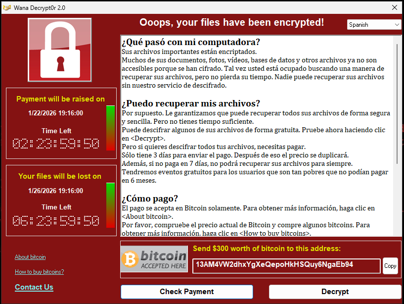
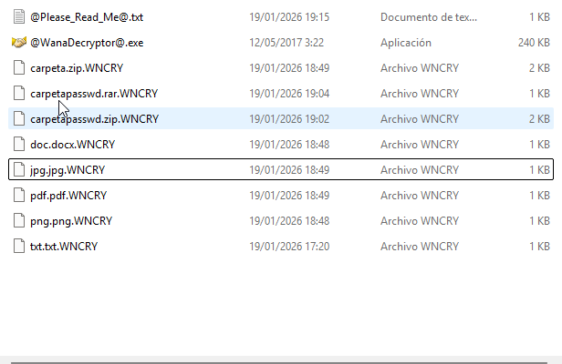

# T08: Seguretat: protegint-nos contra el malware

## 1. Test d'antimalware amb EICAR
- Desactivar SmartScreen i protecció del navegador.
- Baixar el fitxer de prova EICAR des de https://www.eicar.org.
- Activar de nou l’antimalware i comprovar detecció.
- Comprimir el fitxer en formats `.zip`, `.tar`, `.7z` i verificar si l’antimalware detecta l’amenaça.

## 2. Proteccions de Windows 11
### Antivirus i amenaces
- Protecció en temps real
- Protecció al núvol
- Enviament d’exemples
- Historial de deteccions

### Control d’aplicacions i navegador
- SmartScreen
- Control d’execució d’aplicacions sospitoses

### Protecció contra ransomware
- Accés controlat a carpetes
- Recuperació amb OneDrive

## 3. Prova de ransomware (PSRansom)
- Crear fitxers de prova a *Documents*.
- Desactivar protecció contra ransomware.
- Executar PSRansom amb política d’execució desbloquejada.
- Verificar xifrat i fitxer `READ_ME.txt`.

- Desxifrar utilitzant l’ordre corresponent.
- Tornar a activar protecció i repetir la prova (ha de bloquejar-se).

^

## 4. Investigació sobre WannaCry

### 1. Propagació ràpida
- Exploit **EternalBlue** permet infecció sense acció de l’usuari.
- Es comporta com un **cuc**, expandint-se automàticament.
- Molts sistemes no tenien instal·lat el pegat **MS17-010**.

### 2. Vulnerabilitat utilitzada
- Vulnerabilitat: **CVE-2017-0144 (SMBv1)**.
- Gravetat: **alta (CVSS 8.8)**.

### 3. Cal pagar el rescat?
- **No**, no garanteix recuperació i finança activitats criminals.
- Empreses que negocien en casos extrems:
  - SentryOps
  - Coveware
  - CyberSecOp

### 4. Prevenció
- Aplicar pegats (MS17-010).
- **Desactivar SMBv1**.
- Limitar SMB amb tallafocs.
- Còpies de seguretat *offline*.
- Antivirus i segmentació de xarxa.

### 5. Si ja hi ha infecció
- Aïllar equips afectats.
- Aplicar pegats i desactivar SMBv1.
- Analitzar i contenir la propagació.
- Restaurar dades des de *backups*.
- Contactar professionals si cal.

## 5. Prova pràctica de WannaCry (només en VM)
- Snapshot “Abans del virus”.
- Afegir fitxers de prova.

- Baixar i descomprimir WannaCry (`infected`).
- Analitzar detecció amb antimalware.

- Escanejar fitxer a VirusTotal i Kaspersky OpenTip.

- Executar el virus amb xarxa desconnectada i documentar efectes.

- Tornar a la snapshot.
